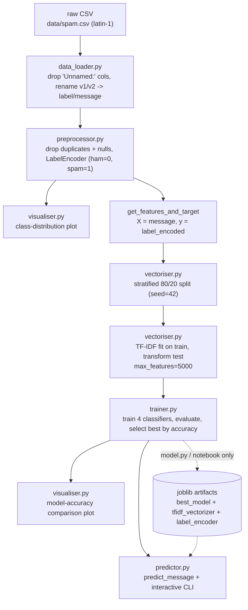

<!--  -->

# <!--SMS--> Spam Detection System

A classical machine-learning pipeline that classifies SMS messages as **ham** (legitimate) or **spam** using TF-IDF features and four scikit-learn classifiers.

[](LICENSE)


---

## Overview

This project implements an end-to-end, modular **binary text-classification** system for SMS spam filtering. It covers the full offline workflow — data loading, cleaning, label encoding, a stratified train/test split, TF-IDF feature extraction, training and comparison of several lightweight classifiers, evaluation, visualization, and an interactive prediction CLI.

The repository exists to demonstrate a clean, reproducible NLP/ML workflow rather than a novel model: a linear/bag-of-words model is a well-matched, cheap, and strong baseline for short SMS spam. The code is intentionally split into single-responsibility modules so each stage can be read, tested, and reused independently.

> **Scope note:** This repository is the classical ML pipeline described below. It does **not** include a served API, Docker, or CI in its tracked source. See [Repository status](#repository-status) for what is present on disk versus committed.

---

## Key Features

These capabilities are implemented in the repository's Python source:

- **Modular pipeline** (`src/`) with one module per stage: data loading, preprocessing, splitting/vectorization, training, prediction, and visualization.
- **Column normalization** that drops the trailing empty columns (`Unnamed: 2..4`) produced by embedded commas in the source CSV and renames `v1`/`v2` to `label`/`message`.
- **Deduplication and null handling** before splitting, plus **LabelEncoder** label encoding (`ham` → 0, `spam` → 1).
- **Stratified 80/20 train/test split** with a fixed random seed (`random_state=42`).
- **TF-IDF feature extraction** (`stop_words="english"`, `max_features=5000`) fit on the training split only.
- **Four candidate classifiers** trained and compared: Multinomial Naive Bayes, Logistic Regression, SVM (SVC), and Random Forest.
- **Evaluation** with accuracy, precision, recall, F1, and confusion matrix, plus a printed per-class `classification_report`.
- **Model persistence** with `joblib` (classifier, TF-IDF vectorizer, and label encoder saved separately).
- **Interactive CLI inference** for classifying free-text messages.
- **Visualizations** of the ham/spam class distribution and the model-accuracy comparison (Matplotlib/Seaborn).
- **Exploratory notebook** (`notebooks/model.ipynb`) documenting the same workflow interactively.

---

## System Architecture

The pipeline is orchestrated by `src/main.py`, which wires the modules together in order. Training and inference reuse the *same* fitted TF-IDF vectorizer and label encoder, which are persisted with `joblib`.



> Persistence is performed by `src/model.py` and the notebook, not by `src/main.py`. `main.py` trains in memory and drops straight into the interactive predictor.

---

## Machine Learning Pipeline

Steps below map to actual code. Steps that do not exist are not listed.

1. **Data ingestion** — `data_loader.load_data()` reads the CSV with `encoding="latin-1"`, drops columns beginning with `Unnamed:`, and standardizes the two remaining columns to `label` and `message`.
2. **Preprocessing** — `preprocessor.preprocess()` drops duplicate rows, drops rows with missing `label`/`message` (only if any exist), and fits a `LabelEncoder` to add a `label_encoded` column.
3. **Feature/target selection** — `preprocessor.get_features_and_target()` returns `X = df["message"]` and `y = df["label_encoded"]`.
4. **Dataset splitting** — `vectoriser.split_data()` performs a stratified split with `test_size=0.2`, `random_state=42`.
5. **Feature extraction** — `vectoriser.vectorise()` fits `TfidfVectorizer(stop_words="english", max_features=5000)` on the **training** split and only transforms the test split (no test leakage). Default `TfidfVectorizer` behavior (lowercasing, default token pattern) applies.
6. **Model training & validation** — `trainer.train_and_evaluate()` fits each model in `MODEL_REGISTRY` on the vectorized training data and predicts on the test split.
7. **Evaluation** — accuracy is computed for every model; the per-model `classification_report` (precision/recall/F1) is printed to stdout. `src/model.py` additionally records precision, recall, F1, and the confusion matrix for each model.
8. **Model selection** — the model with the highest test **accuracy** is returned as `best_model`.
9. **Model persistence** — `src/model.py` (and the notebook) writes `models/best_model.joblib`, `models/tfidf_vectorizer.joblib`, and `models/label_encoder.joblib` with `joblib`. It also writes `evaluation/evaluation_scores.csv` and `evaluation/evaluation_results.json`.
10. **Inference** — `predictor.predict_message()` transforms a single raw message with the fitted vectorizer, predicts, and inverse-transforms the encoded label back to `ham`/`spam`. `run_interactive_predictor()` wraps this in a CLI loop (`exit` to quit).

> **Hyperparameters are inline**, not externalized: `test_size=0.2`, `random_state=42`, `max_features=5000`, `LogisticRegression(max_iter=1000, solver="liblinear")`, `RandomForestClassifier(n_estimators=200)`, and default `SVC(kernel="rbf")`. There is no configuration file or environment-variable layer.

---

## Dataset

| Property | Value |
|---|---|
| File | `data/spam.csv` (duplicated at `src/spam.csv` and `notebooks/spam.csv`, byte-identical) |
| Format | CSV, `latin-1` encoding |
| Raw size | **5,572 rows** |
| Raw columns | `v1` (label), `v2` (message), plus 3 trailing empty columns (`Unnamed: 2`, `Unnamed: 3`, `Unnamed: 4`) |
| Labels | `ham`, `spam` |
| Raw class balance | 4,825 ham / 747 spam (**13.4% spam**) |
| Duplicate rows | 403 exact duplicates |
| After deduplication | **5,169 rows** — 4,516 ham / 653 spam (**12.6% spam**) |
| Missing values | 0 |
| Split | Stratified 80/20, `random_state=42` |

The corpus is the widely distributed SMS Spam Collection format (short English messages labeled `ham`/`spam`). The **dataset source/provenance is not recorded in the repository**; the file is used as-is.

**Auxiliary dataset (not used by any code):** `data/Dataset_10191.csv` (10,191 rows; columns `LABEL`, `TEXT`, `URL`, `EMAIL`, `PHONE`) with three balanced classes — `ham`, `spam`, and `smishing` (3,397 each). No module in `src/` or the notebook references this file.

---

## Models

All models share the same TF-IDF feature matrix. Configurations are taken verbatim from `src/trainer.py` / `src/model.py`.

| Model | Algorithm | Purpose | Key Configuration |
|---|---|---|---|
| Multinomial Naive Bayes | `sklearn.naive_bayes.MultinomialNB` | Baseline probabilistic text classifier | default |
| Logistic Regression | `sklearn.linear_model.LogisticRegression` | Linear baseline | `max_iter=1000`, `solver="liblinear"`, `random_state=42` |
| Support Vector Machine | `sklearn.svm.SVC` | Margin-based classifier | default RBF kernel, `random_state=42`, `probability=False` |
| Random Forest | `sklearn.ensemble.RandomForestClassifier` | Non-linear ensemble baseline | `n_estimators=200`, `random_state=42` |

**Selection rule:** highest **test accuracy**. The committed `models/best_model.joblib` is the `SVC` (`SVC(probability=False, random_state=42)`), consistent with SVC having the top accuracy in the recorded results. Because selection is by accuracy on an imbalanced dataset, the model is not selected on precision/recall/F1.

---

## Results

Recorded in the repository at `evaluation/evaluation_results.json` and `evaluation/evaluation_scores.csv`. Positive class = **spam**; metrics computed on the held-out test split of the non-deduplicated corpus (**1,115 test messages**). Confusion-matrix cells are `[[TN, FP], [FN, TP]]`.

| Model | Accuracy | Precision | Recall | F1 | TN | FP | FN | TP |
|---|---:|---:|---:|---:|---:|---:|---:|---:|
| **Support Vector Machine (SVC)** | **0.9776** | 0.9844 | 0.8456 | 0.9097 | 964 | 2 | 23 | 126 |
| Random Forest | 0.9749 | 1.0000 | 0.8121 | 0.8963 | 966 | 0 | 28 | 121 |
| Multinomial Naive Bayes | 0.9704 | 0.9915 | 0.7852 | 0.8764 | 965 | 1 | 32 | 117 |
| Logistic Regression | 0.9686 | 0.9914 | 0.7718 | 0.8679 | 965 | 1 | 34 | 115 |

A separate, interactive run documented in `notebooks/model.ipynb` reports accuracies of **0.9722** (MNB), **0.9704** (Logistic Regression), **0.9785** (SVC), and **0.9758** (Random Forest) — the same ranking, with small differences attributable to environment/library versions.

### Which error matters more

For spam filtering the two errors are asymmetric:

- **False positive** — a legitimate message hidden as spam. This is the costlier, trust-destroying error (a missed OTP or bank alert).
- **False negative** — a spam message delivered. Annoying but recoverable.

The recorded metrics show the tension clearly: Logistic Regression and Naive Bayes have the highest precision (a near-zero false-positive rate) but the lowest recall (~0.77–0.79, i.e. roughly one in five spam messages missed), while the selected SVC trades a little precision for materially better recall (0.85). Because the project selects by accuracy alone, the precision/recall operating point is not explicitly tuned.

---

## Error Analysis

The repository records **confusion matrices** but no per-message failure examples or trait breakdowns in tracked code. From the recorded confusion matrices (1,115 test messages):

| Model | False positives | False negatives |
|---|---:|---:|
| SVC | 2 | 23 |
| Random Forest | 0 | 28 |
| Multinomial Naive Bayes | 1 | 32 |
| Logistic Regression | 1 | 34 |

The dominant error mode across all four models is **false negatives** — spam that is not caught — while false positives stay near zero. No committed artifact identifies *which* messages are misclassified or why.

---

## Project Structure

Tracked source (what a fresh clone contains):

```text
spam-detection-system/
├── src/
│   ├── main.py           # end-to-end pipeline orchestrator (runs the notebook workflow + CLI)
│   ├── data_loader.py    # load CSV, drop unnamed columns, rename to label/message
│   ├── preprocessor.py   # dedup, null handling, label encoding, X/y extraction
│   ├── vectoriser.py     # stratified split + TF-IDF vectorization
│   ├── trainer.py        # model registry, training loop, accuracy comparison
│   ├── predictor.py      # single-message predict + interactive CLI
│   ├── visualiser.py     # class-distribution and model-comparison plots
│   ├── model.py          # notebook-export training script (also persists artifacts)
│   └── spam.csv          # duplicate copy of the dataset
├── data/
│   ├── spam.csv          # canonical dataset
│   └── Dataset_10191.csv # auxiliary 3-class dataset (unused by code)
├── notebooks/
│   ├── model.ipynb       # exploratory end-to-end notebook
│   └── spam.csv          # duplicate copy of the dataset
├── models/               # committed joblib artifacts
│   ├── best_model.joblib
│   ├── tfidf_vectorizer.joblib
│   └── label_encoder.joblib
├── evaluation/
│   ├── evaluation_results.json   # per-model metrics + confusion matrices
│   └── evaluation_scores.csv     # same metrics, CSV form
├── assets/               # header images and result plots used in this README
├── tests/                # compiled test bytecode only (no .py sources) — see below
├── .gitignore
├── .gitattributes
├── LICENSE               # MIT
├── CONTRIBUTING.md
├── CODE_OF_CONDUCT.md
└── README.md
```

> `tests/`, `build/`, and `src/sms_spam_detector.egg-info/` exist in the working directory but are **not part of the tracked source** — see [Repository status](#repository-status).

---

## Getting Started

### Requirements

No dependency manifest (`requirements.txt` / `pyproject.toml`) is committed. The imports in the source require:

- `pandas`, `numpy`
- `scikit-learn`
- `scipy` (sparse matrices)
- `joblib`
- `matplotlib`, `seaborn`

Python **3.9+** is required by the type annotations used in the modules.

### Install

```bash
python -m pip install pandas numpy scikit-learn scipy joblib matplotlib seaborn
```

### Run the full pipeline

`src/main.py` imports its sibling modules directly, so run it from the repository root (its default data path is `src/spam.csv`). It ends in an interactive prompt:

```bash
python src/main.py
```

This loads the data, prints deduplication/vectorization diagnostics, shows the class-distribution and model-comparison plots, trains and compares the four classifiers, and then starts the interactive predictor. Type a message to classify it, or `exit` to quit.

### Train and persist artifacts

`src/model.py` is the notebook-export script that also writes the `models/` and `evaluation/` artifacts. It uses a Windows-style path (`"src\spam.csv"`):

```bash
python src/model.py
```

### Predict from a persisted artifact

```python
import joblib

model = joblib.load("models/best_model.joblib")
vectorizer = joblib.load("models/tfidf_vectorizer.joblib")
label_encoder = joblib.load("models/label_encoder.joblib")

message = "Congratulations! You won a FREE prize. Text WIN to 80082 to claim."
vec = vectorizer.transform([message])
label = label_encoder.inverse_transform(model.predict(vec))[0]
print(label)  # -> spam
```

> **Version caveat:** the committed artifacts were serialized with **scikit-learn 1.6.1**. Loading them under newer scikit-learn (e.g. 1.9.x) raises an `InconsistentVersionWarning`, and `SVC.predict` fails with `AttributeError: 'SVC' object has no attribute '_effective_probability'`. Use a matching scikit-learn version, or retrain (`python src/model.py`) to regenerate the artifacts. No version pin is committed, so this is currently an environment-dependent step.

---

## Reproducibility and Caveats

These are properties of the current code and committed results, stated explicitly rather than hidden:

- **Recorded results were produced without deduplication.** `evaluation/evaluation_results.json`, `evaluation_scores.csv`, and the notebook correspond to the raw 5,572-row corpus (test set n = 1,115) via `src/model.py` / the notebook, where duplicate removal is commented out.
- **The modular pipeline deduplicates.** `src/preprocessor.py` removes 403 duplicate rows before splitting (test set n = 1,034). Re-running `src/main.py` therefore produces a different split and slightly different metrics than the committed report — for example, in a fresh run Random Forest reached the top accuracy (≈0.9787) rather than SVC. The committed `models/best_model.joblib` (SVC) matches the non-deduplicated path.
- **Selection metric is accuracy**, which is a weak criterion for a ~13% positive class; precision and recall are reported but not optimized.
- **No probability output.** The selected `SVC` is configured with `probability=False`, so it returns a hard label only, not a confidence score.
- **Duplicate dataset copies** (`src/spam.csv`, `notebooks/spam.csv`) are byte-identical to `data/spam.csv` today, but keeping three copies invites silent drift.
- **Reproducible seeds** (`random_state=42`) are set for the split and each model, but library versions are not pinned.

---

## Limitations

- **Bag-of-words ceiling.** TF-IDF unigrams with English stop words cannot model word order or long-range context. Beyond the vectorizer's default lowercasing there is no explicit text normalization, stemming, lemmatization, or character n-grams.
- **Small, single-source, dated corpus.** ~5K English messages; performance on modern spam, other languages, or other domains is unverified.
- **High recall gap.** False negatives dominate (23–34 per model), i.e. a meaningful share of spam is missed.
- **No serving, packaging, config, or tests.** There is no HTTP API, Docker image, CI pipeline, dependency manifest, configuration layer, or runnable test suite in the tracked source.
- **Windows-specific script path** in `src/model.py` (`"src\spam.csv"`).
- **Interactive-only entry points.** `src/main.py` and `src/model.py` end in blocking `input()` loops, so they are not suitable for unattended/batch execution as-is.
- **Artifact version fragility** (see the version caveat above).

---

## Future Improvements

- Reconcile the two data paths: make deduplication explicit and regenerate the committed metrics so code and reports agree.
- Select and report models on **F1 / PR-AUC** rather than accuracy, and tune the decision threshold to a stated precision/recall target.
- Add a dependency manifest and pin versions so training and artifact loading are reproducible.
- Add a runnable test suite (unit tests for preprocessing/vectorization/prediction and a regression test on known spam/ham messages).
- Add per-message error analysis (false-positive/false-negative examples and traits).
- Reduce the duplicated dataset copies to a single canonical file.
- Replace the interactive entry points with non-blocking `__main__`-guarded scripts and remove the hardcoded Windows path.

---

## Repository status

The working directory contains several artifacts that are **not tracked by git** (they are covered by `.gitignore`). They are listed here for transparency and are deliberately **not** documented as project features, because a fresh clone does not include them:

- `build/lib/spam_detector/` — a packaged `spam_detector` module (FastAPI API, pydantic-settings config, and a `spam-train`/`spam-evaluate`/`spam-predict` CLI) that exists **only as build output**. Its `.py` sources are absent from `src/spam_detector/` (only `__pycache__` remains) and it is not committed.
- `src/sms_spam_detector.egg-info/` — packaging metadata for that uncommitted package (`Name: sms-spam-detector`, version 1.0.0).
- `tests/__pycache__/` — compiled test bytecode (`test_api`, `test_data`, `test_training`, etc.) with **no test source files**, so the suite cannot be run as committed.
- `evaluation/evaluate_report.json` — a report for a *different* model ("Calibrated Linear SVM") with ROC-AUC/PR-AUC and error examples, not reproduced by any tracked code (this path is explicitly gitignored).

If these are intended to be part of the project, the source files for the package and tests need to be committed (and the README updated accordingly).

---

## Contributing

Contributions are welcome. Please open an Issue or submit a Pull Request. Additions should be accompanied by clear documentation and, where relevant, updated evaluation results (see [CONTRIBUTING.md](CONTRIBUTING.md)). All participation is governed by the project [Code of Conduct](CODE_OF_CONDUCT.md).

## License

Released under the MIT License. See [LICENSE](LICENSE).
